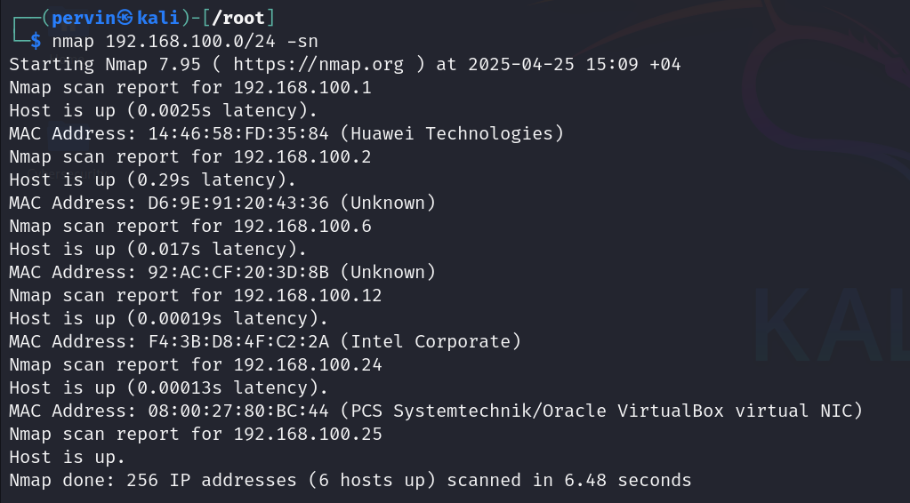
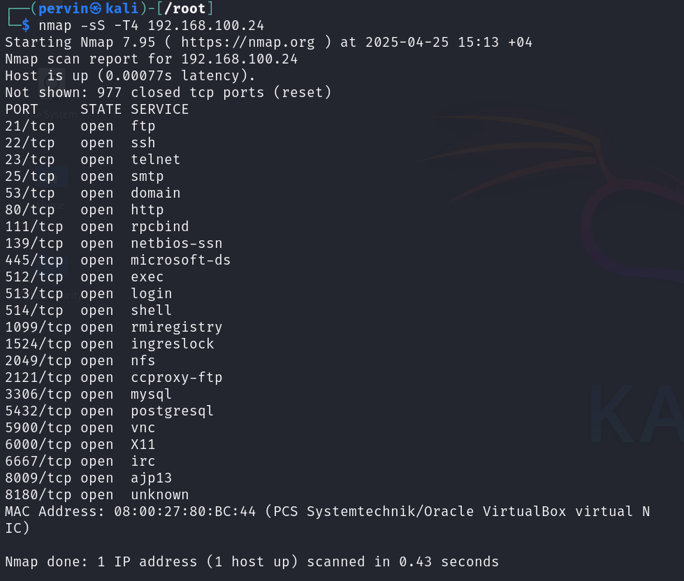
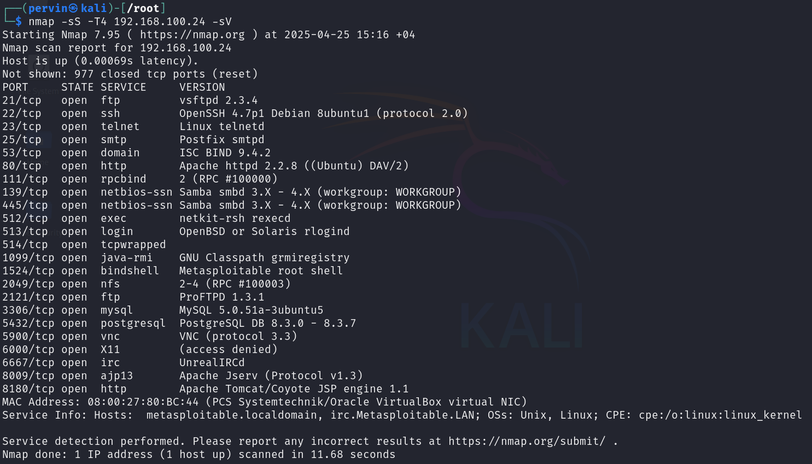
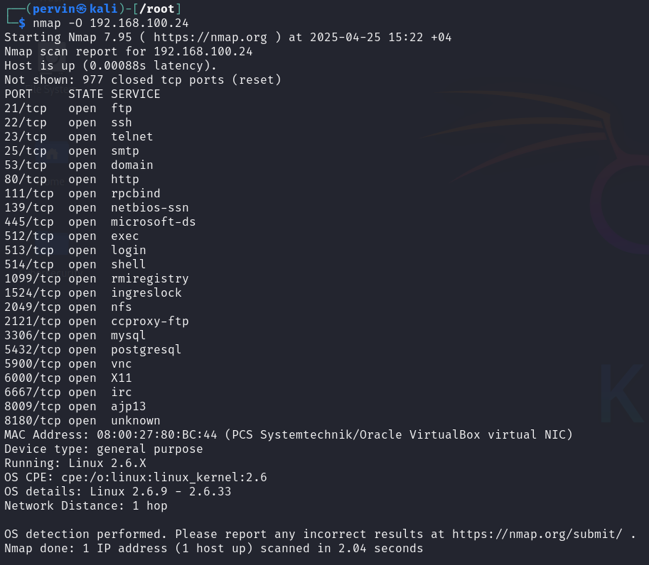
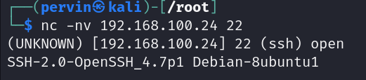

# CyberSecurity Lab 3

This repository contains screenshots related to **Lab 3** of the CyberSecurity course.

## Screenshots

The following images demonstrate the steps or outcomes from the lab:

192.168.100.1      (Huawei Technologies)  
192.168.100.2      (Unknown)  
192.168.100.6      (Unknown)  
192.168.100.12     (Intel Corporate)  
192.168.100.24     (PCS Systemtechnik / Oracle VirtualBox virtual)

***

21/tcp   open  ftp
22/tcp   open  ssh
23/tcp   open  telnet
25/tcp   open  smtp
80/tcp   open  http

***

22/tcp	open	ssh	OpenSSH 4.7p1 Debian 8ubuntu1 (protocol 2.0)

80/tcp	open	http	Apache httpd 2.2.8 ((Ubuntu) DAV/2)

***

Running: Linux 2.6.X
OS CPE: cpe:/o:linux:linux_kernel:2.6
OS details: Linux 2.6.9 - 2.6.33

***

SSH-2.0-OpenSSH_4.7p1 Debian-8ubuntu1 
